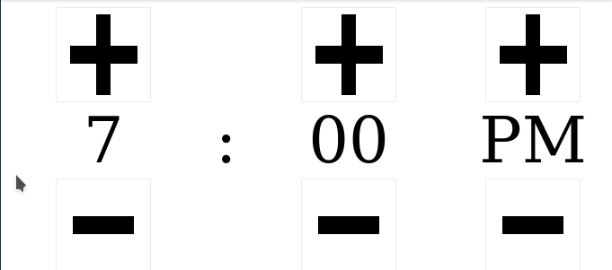

This is just one small contribution to the Laminar ecosystem.
It is my first UI component, and it's very narrowly useful at the moment.
I just love Laminar and want to make it easier for people to experiment with it!



To use:
```scala
libraryDependencies += "com.billdingsoftware" %%% "timepicker" % "0.1.6"
```

The simplest use-case is:
```scala
TimePicker.basicWithTypedTime("08:03") match {
  case TimePickerTyped(component: Div, time: L.Signal[BusTime]) =>
    div(
      child.text <-- time.map("Exposed time: " + _ ) ,
      component
    )
}
```

You can also drop in custom up/down button elements via:
```
  TimePicker.from24hourString(
    initialTime = "09:30",
    incrementRep = span("Inc"),
    decrementRep = span("Dec")
  )
```

TODOs:
- 24 hour display mode
- Constructor that accepts a `String=>UserDefinedTimeType` and returns a `Signal[UserDefinedTimeType]`
- A hundred other things
